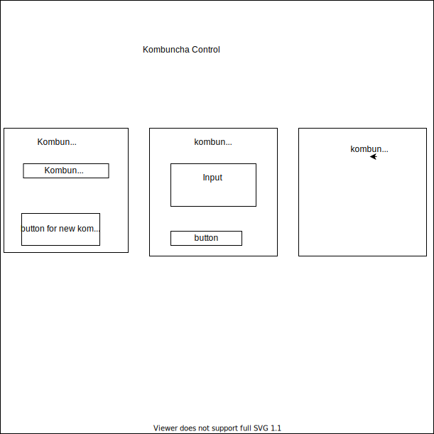

 # Kombuncha

#### Friday Practice 

#### By StevenL Sept  11, 2020

## Description
The purpose of this application is to prove my understand of functional programming with ReactJS.
The user can add, delete kombuncha as they wish.

### App where you can view kombuncha list as well as add differnt flavor kombuncha with different props

## Setup/Installation Requirements

* Clone this repository.
* Open in the text editor of your choice
* Open terminal and npm install
* Then run npm start

## Known Bugs

No

## Support and contact details

If you have any suggestions or questions please message me on github

## Technologies Used

React.JS

### License

This software is licensed under the MIT license.

Copyright (c) 2020 **_StevenLy_**